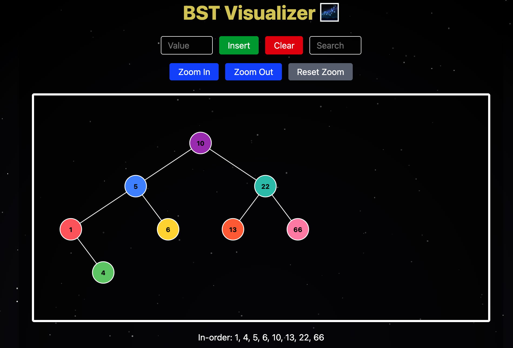
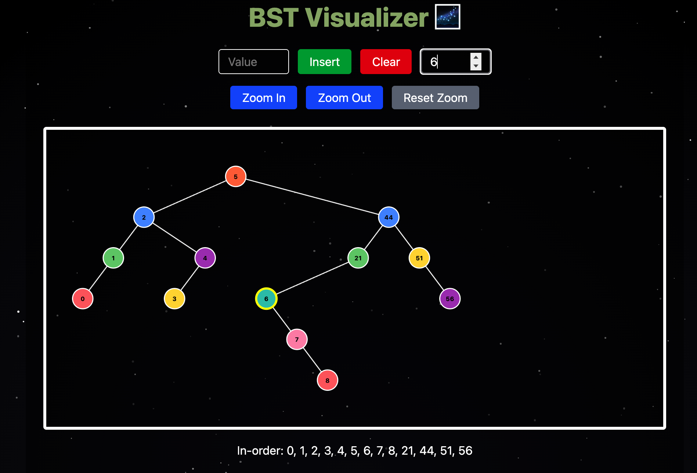

# 🌌 Galaxy BST Visualizer

An interactive Binary Search Tree visualizer set against an animated galaxy backdrop, built with **Vite + React + Tailwind CSS + Framer Motion**.  
Insert, clear, zoom, search & highlight your BST while stars blink and the heading cycles through rainbow hues!

---

## 🌟 Demo Video
## 🌟 Demo Video

[](assets/demo.mov)

Click the image to watch or download the demo.
<!-- \
<video src="assets/demo.mov" controls width="600" poster="assets/galaxy_bg.png">
  Your browser does not support the video tag.  
  [Download the demo video](assets/demo.mp4)
</video> -->

## 📸 Screenshots


<p align="center">
  
</p>
<p align="center">
  
</p>


---

## ✨ Features

- **Animated Galaxy Background** with 200 blinking stars  
- **Color-Cycling Heading** via CSS keyframe animation  
- **Framer Motion** for:
  - Smooth edge-drawing  
  - Springy node pop-ins & hover effects  
- **Interactive Controls**:
  - Insert / Clear nodes  
  - Zoom In / Zoom Out / Reset Zoom  
  - Search & Highlight a node  
- **In-Order Traversal** display  
- **Responsive, scrollable SVG** that never clips your tree  
- **Tailwind CSS** styling throughout

---

## 🛠️ Tech Stack

| Frontend                |  
|-------------------------|  
| Vite                    |  
| React                   |  
| Tailwind CSS            |  
| Framer Motion           |  

---

## 🚀 Getting Started

### Prerequisites

- [Node.js](https://nodejs.org/) v14+  
- [npm](https://www.npmjs.com/) or yarn  

### Installation

1. **Clone the repo**  
   ```bash
   git clone https://github.com/your-username/galaxy-bst-visualizer.git
   cd galaxy-bst-visualizer


2.	Install dependencies

    cd src
    npm install

3.	Run Development Server
    npm run dev

📁 Project Structure
galaxy-bst-visualizer/
├── assets/               # Screenshots and images for README
│   ├── galaxy_bg.png
│   ├── bst_insert.png
│   └── zoom_search.png
|
├── src/
│   ├── index.css         # Tailwind & custom galaxy/star CSS
│   ├── main.jsx          # Vite entry point
│   ├── App.jsx           # Renders BSTVisualizer
│   └── BSTVisualizer.jsx # All visualization logic & animations
|
├── index.html            # Vite HTML template
├── package.json
└── vite.config.js


🔧 Customization
	•	Star Count / Blink Speed: adjust in useMemo and @keyframes blink
	•	Color Palette: edit COLORS array in BSTVisualizer.jsx
	•	Animation Timing: tweak Framer Motion transition props
	•	Galaxy Gradient: modify radial-gradient in index.css

⸻

🤝 Contributing
	1.	Fork this repo
	2.	Create a new branch (git checkout -b feature/my-feature)
	3.	Commit your changes
	4.	Push to your branch (git push origin feature/my-feature)
	5.	Open a Pull Request

